<!-- Header animado (onda com gradiente estilo Wired) -->
<p align="center">
  
</p>

<h1 align="center">Olá, eu sou o Mateus 👋🐧</h1>
<h3 align="center">Estudante de ADS | Dev Python & Automação</h3>

<p align="center">
  
</p>

<p align="center">
  <a href="https://www.linkedin.com/" target="_blank">
    
  </a>
  <a href="mailto:mateus06sepul@outlook.com" target="_blank">
    
  </a>
  <a href="https://github.com/MateusSepul" target="_blank">
    
  </a>
</p>

<!-- 
  💡 Quer a Lain de fato aqui? Suba um GIF/imagem no repositório (ex: assets/lain.gif)
  e descomente a linha abaixo:
-->
<!--
<p align="center"></p>
-->

---

### 🌐 Navi // conectado à Wired

```bash
lain@wired:~$ whoami
mateus — estudante de ADS, dev Python & automação

lain@wired:~$ cat /etc/motd
"Present day, present time."

lain@wired:~$ ./status.sh
[ OK ] Linux ............ rodando
[ OK ] Café ............. carregado
[ OK ] Wired ............ conectado
[WARN] Sono ............. não encontrado
```

---

### 👨‍💻 Sobre mim
- 🎓 Cursando **Análise e Desenvolvimento de Sistemas (ADS)**
- 💡 Desenvolvo **automação de processos** e ferramentas em **Python**
- 🖥️ Trabalho tanto com **Front-end** quanto **Back-end**
- 📚 Também desenvolvo **projetos acadêmicos** (incluindo TCC)
- 🐧 Usuário fiel de **Linux** no dia a dia
- 🌱 Sempre estudando novas tecnologias em **Linux, SQL, Python, Java, C++, JavaScript, TypeScript e Node.js**
- ⚡ Interesses: dados, automação e desenvolvimento de software
- 🌀 Fã de **Serial Experiments Lain** e da estética cyberpunk/Wired

---

<p align="center">
  
</p>

<h4 align="center">Linguagens</h4>
<p align="center">
  
  
  
  
  
  
  
</p>

<h4 align="center">Front-end & Back-end</h4>
<p align="center">
  
  
  
  
</p>

<h4 align="center">Mobile</h4>
<p align="center">
  
  
  
</p>

<h4 align="center">Game Dev</h4>
<p align="center">
  
</p>

<h4 align="center">Dados & Banco de Dados</h4>
<p align="center">
  
  
  
  
</p>

<h4 align="center">IA & Análise de Dados</h4>
<p align="center">
  
  
</p>

<h4 align="center">Sistemas Operacionais</h4>
<p align="center">
  
  
  
  
  
  
  
</p>

---

### 🚀 Projetos em destaque
| Projeto | Descrição | Tecnologia |
|---|---|---|
| [**planilhas-auto**](https://github.com/MateusSepul/planilhas-auto) | Ferramenta desktop com interface gráfica para copiar dados entre planilhas Excel, mapeando colunas de origem para destino de forma visual — suporta salvar e reutilizar perfis de mapeamento | Python |
| [**raytracer**](https://github.com/MateusSepul/raytracer) | Renderizador Ray Tracer simples e eficiente | C++17 |
| [**Pinneddot**](https://github.com/MateusSepul/Pinneddot) | Mural coletivo de pins em tempo real — mensagens e desenhos fixados ao vivo | TypeScript |
| [**verifica-noticia**](https://github.com/wallace-2105/verifica-noticia) | Plataforma de verificação de fake news com IA (GPT-4o): analisa textos/URLs e retorna veredito e confiabilidade — Projeto de TCC | JavaScript |
| [**Hersafe-SecurityFast**](https://github.com/MateusSepul/Hersafe-SecurityFast) | Contribuição em projeto voltado à segurança (fork) | TypeScript |

---

<p align="center">
  
</p>

---

### 📊 Estatísticas do GitHub
<p align="center">
  
</p>

<p align="center">
  
  
</p>

<p align="center">
  
</p>

### 🐍 Snake na Wired
<p align="center">
  
</p>

---

### 📫 Como me achar
<p align="center">
  <a href="https://www.linkedin.com/" target="_blank"></a>
  <a href="mailto:mateus06sepul@outlook.com"></a>
  <a href="https://github.com/MateusSepul"></a>
</p>

<p align="center">
  
</p>

<p align="center">
  
</p>


